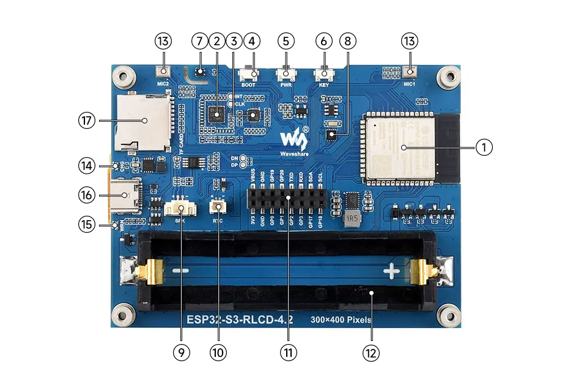
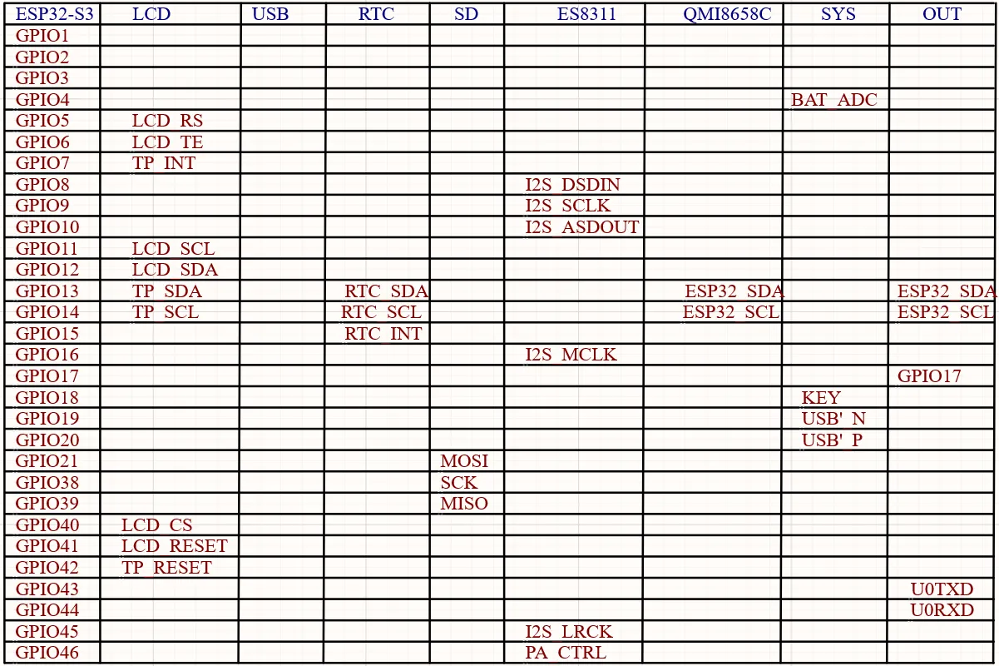

# esp32-adc-detector

手持式隐藏发射设备探测器：用 ESP32-S3 + AD8318 射频检波器，在酒店、民宿等场所临时检查正在发射信号的隐藏设备（Wi-Fi 摄像头、BLE 追踪器、GSM 窃听器等）。

方案、算法和开发阶段见 [docs/design.md](docs/design.md)。

## 硬件

- 主控板：[Waveshare ESP32-S3-RLCD-4.2](https://docs.waveshare.net/ESP32-S3-RLCD-4.2)（ESP32-S3-WROOM-1-N16R8，4.2" 300×400 反射式屏幕，18650 电池座）
- 检波器：AD8318（1 MHz–8 GHz，输出 0.5–2.1 V，信号越强电压越低），输出接 GPIO1，屏蔽层接 GND

### 板卡



### GPIO 分配



## 构建

PlatformIO + ESP-IDF：

```sh
pio run                 # 编译
pio run -t upload       # 烧录
pio device monitor      # 串口日志
```
